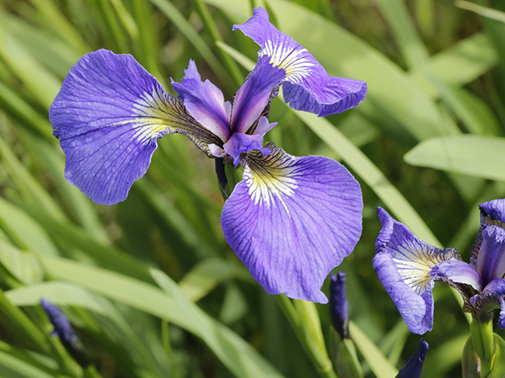
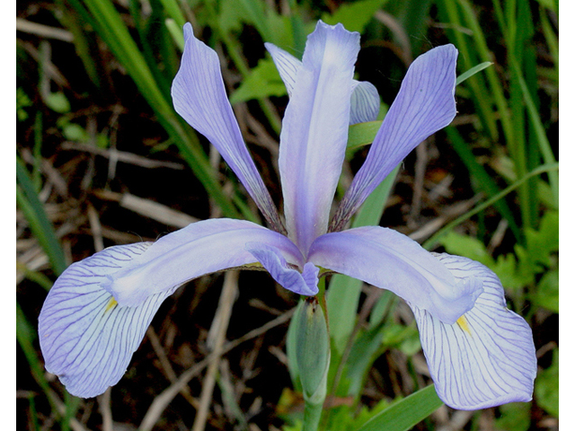
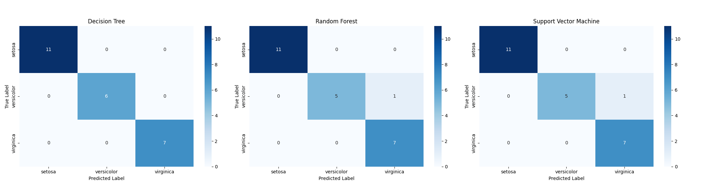
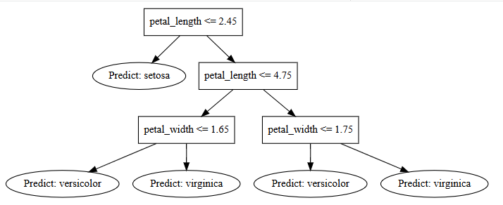

# Iris Species Classification with Spark MLlib 🌺

## Project Overview
This project was developed for STQD6324 Data Management Assignment 1. The objective of this assignment is to perform a multiclass classification task using the Iris dataset with Spark MLlib.

Several machine learning classification algorithms were implemented, tuned, evaluated, and compared to identify the best-performing model for iris species prediction.

The project demonstrates the complete machine learning workflow including:

- Data Loading: Automated retrieval of the Iris dataset from a public repository.
- Data Preprocessing: Transforming categorical labels using StringIndexer and combining features into vectors with VectorAssembler.
- Model Training & Tuning: Systematic hyperparameter optimization using CrossValidator and ParamGridBuilder.
- Evaluation: Comparing models using Accuracy and F1-Score to ensure performance across all classes.
- Visualization: Visualizing classification boundaries and logic to interpret model behavior.
  
## Dataset
The project uses the famous Iris dataset, which contains measurements of iris flowers from three different species:

| Iris Setosa | Iris Versicolor | Iris Virginica |
|:---:|:---:|:---:|
|  |  |  |

### Features
The dataset contains four numerical features:
- Sepal Length:	Length of sepal (cm)
- Sepal Width:	Width of sepal (cm)
- Petal Length:	Length of petal (cm)
- Petal Width:	Width of petal (cm)

 ### Target Variable
 - Species:	Iris flower species
   
## Methodology
The following workflow was implemented in this project:

1. Load dataset into Spark DataFrame
2. Perform data preprocessing
3. Encode categorical labels using StringIndexer
4. Assemble features using VectorAssembler
5. Split dataset into training and testing sets
6. Train multiple classification models
7. Perform hyperparameter tuning using cross-validation and grid search
8. Evaluate model performance
9. Compare all models
10. Identify the best-performing model 
    
## Results and Discussion
### Model Comparison

| Model | Accuracy | Strengths | Limitations |
|---|---|---|---|
| Decision Tree | 100.00% | Highly interpretable and easy to visualise decision rules | Prone to overfitting and high variance |
| Random Forest | 95.83% | Reduces overfitting through ensemble learning | Slightly lower accuracy on this specific test set due to one misclassification, more difficult to interpret |
| Support Vector Machine | 95.83% | Effective at finding optimal decision boundaries | Performance can dip when feature regions overlap; one 'versicolor' instance fell on the "wrong side" of the boundary |

### Confusion Matrices
<p align="center">
  
</p>

- Perfect Classification: The Decision Tree confusion matrix shows zero misclassifications, correctly identifying every instance of Setosa, Versicolor, and Virginica in the test set.
- Identified Errors: Both the Random Forest and Support Vector Machine matrices reveal a single error where one 'versicolor' instance was incorrectly predicted as 'virginica'.
- Root Cause: As noted in the comparison table, this occurred because that specific data point fell on the "wrong side" of the decision boundary where the feature regions for those two species overlap. This demonstrates that while the models are highly robust, they encounter challenges when feature values are not perfectly distinct.

### Decision Tree Visualization

<p align="center">
  
</p>


- Decision Tree visualization provides complete transparency by allowing users can visually trace how the model reach a conclusion. For example, the tree reveals that petal width and petal length are the most discriminative features where a single split on petal width is often enough to perfectly isolate the Setosa species.


## Repository Structure

```text
Assignment1-STQD6324/
│
├── IrisClassification_Assignment1_STQD6324.ipynb
├── README.md
├── cm.png
├── dt.png
├── setosa.png
├── versicolor.png
└── virginica.png
```

## How to Reproduce the Analysis
Recommended Platform: Google Colab

This project was developed  using Google Colab to simplify the execution of PySpark without requiring manual local Java or Spark configuration.

Steps
1. Navigate to the IrisClassification_Assignment1_STQD6324.ipynb in this repository.
2. Click the **Open in Colab** badge at the top of the notebook file.
3. The notebook will automatically open in Google Colab.
4. Ensure the runtime is connected.
5. Run all notebook cells sequentially from top to bottom.


